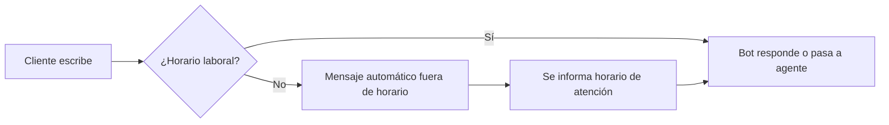

<Callout kind="info">
  Después de registrar tu cuenta y conectar WhatsApp, hay varias configuraciones iniciales recomendadas para sacar el máximo provecho de E-SMART360.
</Callout>

## Perfil de negocio en WhatsApp

Configura la información que verán tus clientes al abrir tu perfil:

1. **Nombre del negocio** — Debe coincidir con tu documentación legal (para verificación)
2. **Descripción** — Breve texto sobre tu empresa (máximo 512 caracteres)
3. **Dirección** — Ubicación física de tu negocio
4. **Correo electrónico** — De contacto
5. **Sitio web** — URL de tu página
6. **Horario de atención** — Días y horas laborales
7. **Categoría** — Industria o rubro de tu negocio

## Configura el canal de pago

<Callout kind="warning">
  Para enviar mensajes a través de WhatsApp API, debes registrar un método de pago. Meta factura por conversación.
</Callout>

<Steps>
  <Step title="Accede a Configuración de pago">
    Desde el dashboard, ve a Configuración > Facturación > Método de pago.
  </Step>
  <Step title="Agrega tarjeta de crédito/débito">
    Ingresa los datos de tu tarjeta. Meta cobrará según el volumen de conversaciones.
  </Step>
  <Step title="Confirma el método">
    Meta hará un cargo de prueba (que será reembolsado) para verificar la tarjeta.
  </Step>
</Steps>

## Invitar a tu equipo

Agrega a los miembros de tu equipo para que puedan gestionar conversaciones:

1. Ve a Configuración > Equipo > Invitar miembro
2. Ingresa el correo del usuario
3. Asigna un rol (Administrador, Agente, Supervisor)
4. El usuario recibirá un correo de invitación

## Roles disponibles

| Rol | Permisos |
|-----|---------|
| **Administrador** | Acceso completo a todas las funciones y configuración |
| **Supervisor** | Ver todas las conversaciones, reportes, gestionar agentes |
| **Agente** | Atender conversaciones asignadas, sin acceso a configuración |
| **Soporte** | Solo lectura de conversaciones |

## Configuración de horario laboral

Define cuándo tu equipo está disponible:

1. Ve a Configuración > Disponibilidad
2. Define días y horas laborales
3. Configura el mensaje automático fuera de horario

<Callout kind="success">
  Con estos pasos, tu cuenta está lista para operar. El siguiente paso es crear tu primer flujo de automatización con el Flow Builder.
</Callout>
