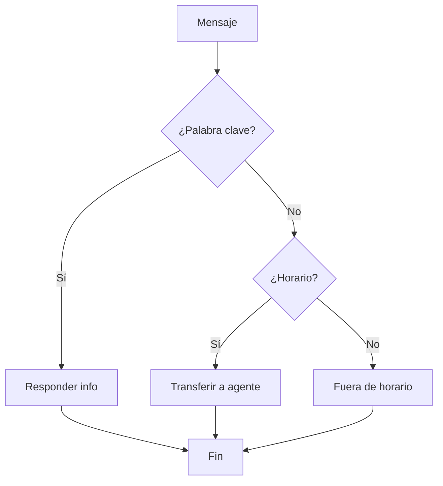

<Callout kind="info">El Flow Builder es un constructor visual tipo "arrastrar y soltar" para crear chatbots y flujos de conversación sin código.</Callout>

## ¿Qué es el Flow Builder?

Es la herramienta central de automatización. Diseña conversaciones interactivas que respondan automáticamente, guíen procesos de venta y escalen a humanos.

<Columns cols="2">
  <Card title="Visual e intuitivo">Interfaz drag & drop. Sin programación.</Card>
  <Card title="En tiempo real">Cambios instantáneos. Publica sin interrumpir.</Card>
  <Card title="15+ bloques">Mensajes, condiciones, HTTP, temporizadores.</Card>
  <Card title="Multicanal">WhatsApp, Instagram, Messenger, Telegram, Webchat.</Card>
</Columns>

## Bloques Disponibles

| Tipo | Función |
|------|---------|
| Enviar mensaje | Texto, imágenes, botones, listas, documentos |
| Preguntar usuario | Captura texto, número, email, teléfono, fecha |
| Condición | Ramifica según respuestas o variables |
| Temporizador | Espera programada (segundos a 24h) |
| HTTP Request | Llamadas a APIs externas |
| Asignar agente | Transfiere a humano |

## Cómo Funciona

<Steps>
  <Step title="Selecciona disparador">Mensaje, palabra clave, botón o evento programado.</Step>
  <Step title="Diseña el flujo">Arrastra bloques al lienzo y conéctalos.</Step>
  <Step title="Configura condiciones">Lógica condicional para ramificar según respuestas.</Step>
  <Step title="Prueba y publica">Simula y luego publica a producción.</Step>
</Steps>

<Callout kind="tip">Empieza simple: flujo de bienvenida con 3-4 bloques.</Callout>
