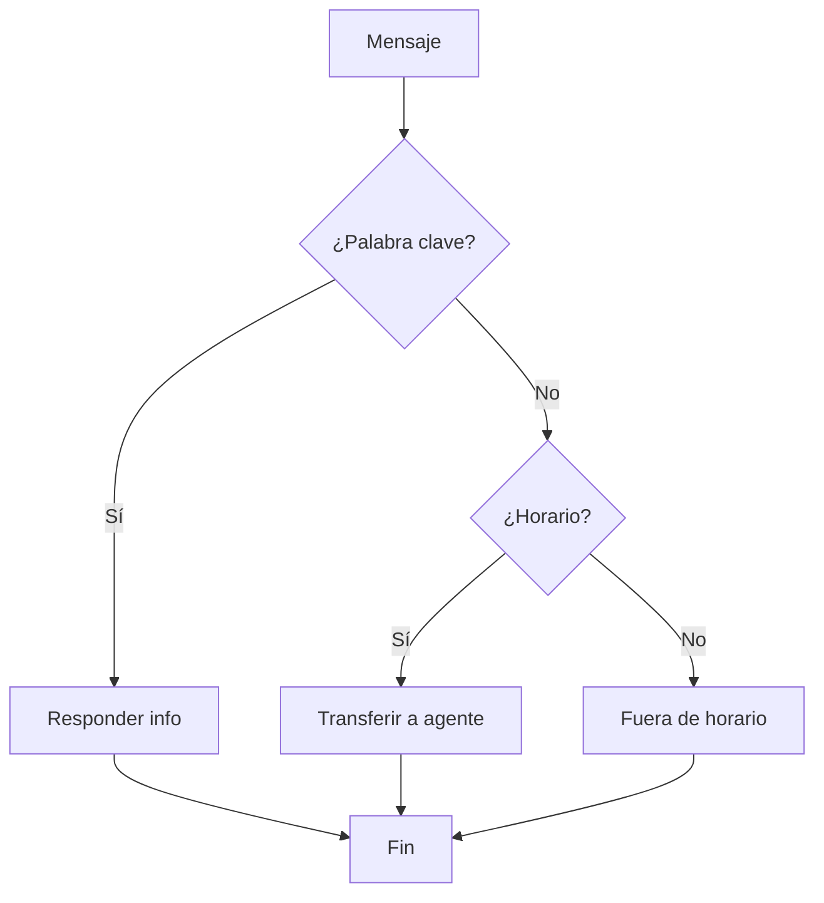

El Flow Builder es un constructor visual tipo "arrastrar y soltar" para crear chatbots y flujos de conversación sin código.

## ¿Qué es el Flow Builder?

Es la herramienta central de automatización. Diseña conversaciones interactivas que respondan automáticamente, guíen procesos de venta y escalen a humanos.

## Bloques Disponibles

| Tipo              | Función                                       |
| ----------------- | --------------------------------------------- |
| Enviar mensaje    | Texto, imágenes, botones, listas, documentos  |
| Preguntar usuario | Captura texto, número, email, teléfono, fecha |
| Condición         | Ramifica según respuestas o variables         |
| Temporizador      | Espera programada (segundos a 24h)            |
| HTTP Request      | Llamadas a APIs externas                      |
| Asignar agente    | Transfiere a humano                           |

## Cómo Funciona

Empieza simple: flujo de bienvenida con 3-4 bloques.

