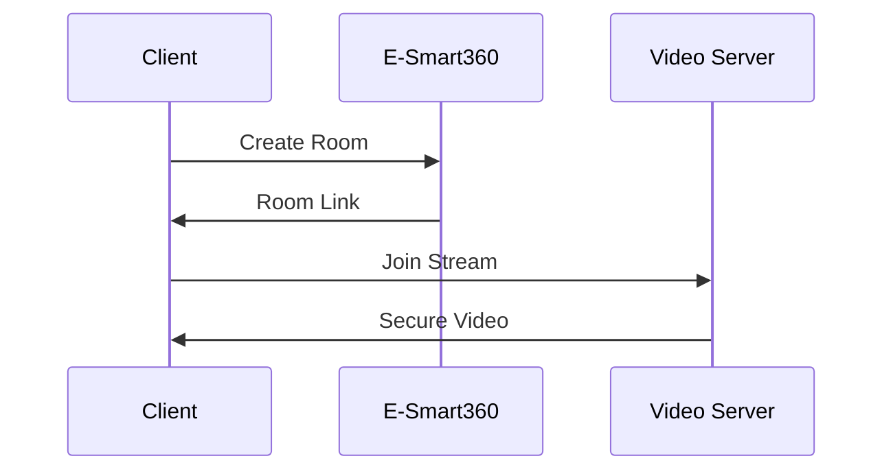

## Overview

E-Smart360 provides AI-powered tools to enhance customer interactions across channels. You can set up conversational AI platforms, configure voice receptionists, implement virtual offices, and create digital business cards. These features integrate with the official Meta API for seamless omnicanal experiences.

<Columns cols={2}>
  <Card title="AI Chat Platforms" icon="message-circle" href="#ai-chat">
    Build intelligent chat systems that handle customer queries 24/7.
  </Card>
  <Card title="Voice AI Receptionists" icon="phone" href="#voice-ai">
    Deploy automated voice agents for constant support.
  </Card>
  <Card title="Virtual Office" icon="video" href="#virtual-office">
    Enable video streaming for remote consultations.
  </Card>
  <Card title="Digital Business Cards" icon="id-card" href="#digital-cards">
    Generate and share professional digital profiles.
  </Card>
</Columns>

## Setting up AI-Powered Chat Platforms

Start by integrating E-Smart360's AI chat platform. This uses conversational AI to resolve operational processes.

<Steps>
  <Step title="Create API Key" icon="key">
    Log in to your E-Smart360 dashboard at `https://dashboard.example.com` and generate an API key.
  </Step>
  <Step title="Configure Chat Endpoint" icon="settings">
    Set up the webhook URL to `https://your-webhook-url.com/webhook`.
  </Step>
  <Step title="Test Integration" icon="play">
    Send a test message via the Meta API.
  </Step>
</Steps>

Use this API request to initialize a chat session:

<Request tabs="JavaScript,cURL">
  ````javascript
  const response = await fetch('https://api.example.com/v1/chats', {
    method: 'POST',
    headers: {
      'Authorization': 'Bearer YOUR_API_KEY',
      'Content-Type': 'application/json'
    },
    body: JSON.stringify({
      userId: 'user123',
      message: 'Hello, I need help with my order.'
    })
  });
  ````
  ````bash
  curl -X POST https://api.example.com/v1/chats \
    -H "Authorization: Bearer YOUR_API_KEY" \
    -H "Content-Type: application/json" \
    -d '{
      "userId": "user123",
      "message": "Hello, I need help with my order."
    }'
  ````
</Request>

<Response tabs="200">
  ````json
  {
    "chatId": "chat_456",
    "response": "How can I assist with your order today?",
    "status": "active"
  }
  ````
</Response>

<Callout kind="tip">
  Replace `YOUR_API_KEY` with your actual key from the dashboard.
</Callout>

## Configuring Voice AI Receptionists

Voice AI agents provide 24/7 receptionist services. Configure them for incoming calls.

<Tabs>
  <Tab title="Phone" icon="phone">
    <ParamField header="X-Voice-Token" param-type="string" required="true">
      Voice authentication token.
    </ParamField>
    
    ````javascript
    const callConfig = {
      phoneNumber: '+1234567890',
      greeting: 'Welcome to E-Smart360. How may I help?'
    };
    ````
  </Tab>
  <Tab title="Webhook Setup" icon="link">
    Point voice webhooks to `https://api.example.com/voice`.
    
    <ParamField query="agentId" param-type="string" required="true">
      Unique agent identifier.
    </ParamField>
  </Tab>
</Tabs>

## Implementing Virtual Office with Video Streaming

Set up virtual office features for video consultations.

<Steps>
  <Step title="Enable Video Module" icon="video">
    Activate in dashboard settings.
  </Step>
  <Step title="Generate Room Link" icon="share-2">
    Use the API to create rooms.
  </Step>
  <Step title="Share Securely" icon="lock">
    Distribute links via chat or email.
  </Step>
</Steps>



## Creating and Sharing Digital Business Cards

Generate digital cards for professional sharing.

<CodeGroup tabs="JavaScript,Python">
  ````javascript
  const card = await fetch('https://api.example.com/v1/cards', {
    method: 'POST',
    headers: { 'Authorization': 'Bearer YOUR_API_KEY' },
    body: JSON.stringify({
      name: 'John Doe',
      title: 'Sales Manager',
      company: 'E-Smart360'
    })
  });
  const link = await card.json().shareUrl;
  console.log(link);
  ````
  ````python
  import requests
  response = requests.post(
      'https://api.example.com/v1/cards',
      headers={'Authorization': 'Bearer YOUR_API_KEY'},
      json={
          'name': 'John Doe',
          'title': 'Sales Manager',
          'company': 'E-Smart360'
      }
  )
  link = response.json()['shareUrl']
  print(link)
  ````
</CodeGroup>

<Expandable title="Advanced Customization" default-open="false">
  Add custom fields like QR codes or social links via the `extras` parameter.
</Expandable>

<Callout kind="info">
  All features support Meta API integration for enhanced reach.
</Callout>

## Next Steps

<Columns cols={2}>
  <Card title="API Reference" icon="code" href="/authentication">
    Explore full API endpoints.
  </Card>
  <Card title="Troubleshooting" icon="help-circle" href="/quickstart">
    Common issues and solutions.
  </Card>
</Columns>