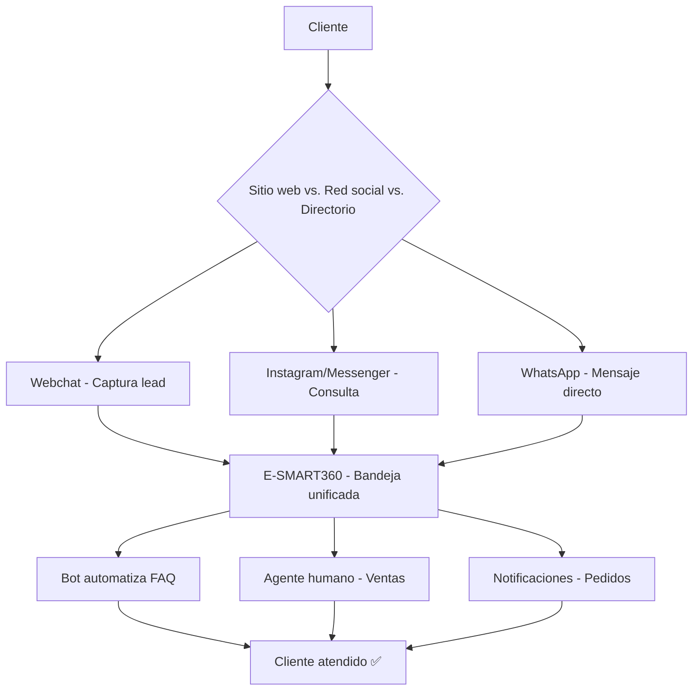

<Callout kind="info">
  E-SMART360 soporta 5 canales principales. Cada uno tiene fortalezas distintas. Esta guía te ayuda a decidir cuál(es) implementar según tu tipo de negocio.
</Callout>

## Comparativa General

| Característica | WhatsApp | Instagram | Messenger | Telegram | Webchat |
|:-:|:-:|:-:|:-:|:-:|:-:|
| **Alcance global** | ✅ 2B+ usuarios | ✅ 1B+ usuarios | ✅ 1B+ usuarios | ✅ 900M+ usuarios | ✅ Propio |
| **Chatbot 24/7** | ✅ | ✅ | ✅ | ✅ | ✅ |
| **Catálogo productos** | ✅ Nativo | ❌ | ❌ | ❌ | ✅ |
| **Broadcasting masivo** | ✅ Con plantillas | ❌ | ❌ | ✅ Sin restricción | ❌ |
| **Botones interactivos** | ✅ CTA, listas | ✅ | ✅ | ✅ Botones inline | ✅ |
| **Pagos integrados** | ✅ WhatsApp Pay | ❌ | ❌ | ❌ | ✅ |
| **Verificación oficial** | ✅ Palomita verde | ✅ | ❌ | ✅ | N/A |
| **Costo por mensaje** | 💰 Por conversación | 🆓 | 🆓 | 🆓 | 🆓 |
| **Personalización** | Media | Media | Media | Alta | Total |

## ¿Qué canal elegir según tu negocio?

<Columns cols="3">
  <Card title="🛒 E-commerce / Tienda">
    **WHATSAPP** es tu mejor opción. Catálogos, carritos abandonados, notificaciones de pedidos y pagos integrados. Complementa con **Webchat** en tu tienda online.
  </Card>
  <Card title="🏢 Servicios / Soporte">
    **WHATSAPP + WEBChat**. WhatsApp para comunicación directa, Webchat para capturar leads desde tu sitio web. El agente IA puede manejar FAQ 24/7.
  </Card>
  <Card title="📢 Medios / Comunidad">
    **TELEGRAM** es ideal para broadcasting masivo sin restricciones de plantillas. Mensajes ilimitados a todos tus suscriptores.
  </Card>
</Columns>

<Columns cols="2">
  <Card title="🎨 Redes Sociales">
    **INSTAGRAM + MESSENGER** si tu audiencia está en redes sociales. Perfecto para marcas visuales y atención al cliente desde la plataforma que tus clientes ya usan.
  </Card>
  <Card title="🏪 Negocio Local / PYME">
    **WHATSAPP** es indispensable en Latinoamérica. Es el canal con mayor penetración y aceptación. Empieza aquí y expande después.
  </Card>
</Columns>

## Estrategia Multicanal Recomendada

## Costos Asociados

| Canal | Costo plataforma | Costo Meta/Mensajería |
|-------|:-:|:-:|
| **WhatsApp** | ✔️ Incluido en plan | 💲 Por conversación (según región y tipo) |
| **Instagram** | ✔️ Incluido en plan | 🆓 Gratuito |
| **Messenger** | ✔️ Incluido en plan | 🆓 Gratuito |
| **Telegram** | ✔️ Incluido en plan | 🆓 Gratuito |
| **Webchat** | ✔️ Incluido en plan | 🆓 Gratuito |

<Callout kind="success">
  **Recomendación para empezar:** Comienza con **WhatsApp + Webchat**. Son los canales con mayor retorno de inversión para la mayoría de los negocios. Una vez estable, agrega Instagram si tu marca es visual.
</Callout>
